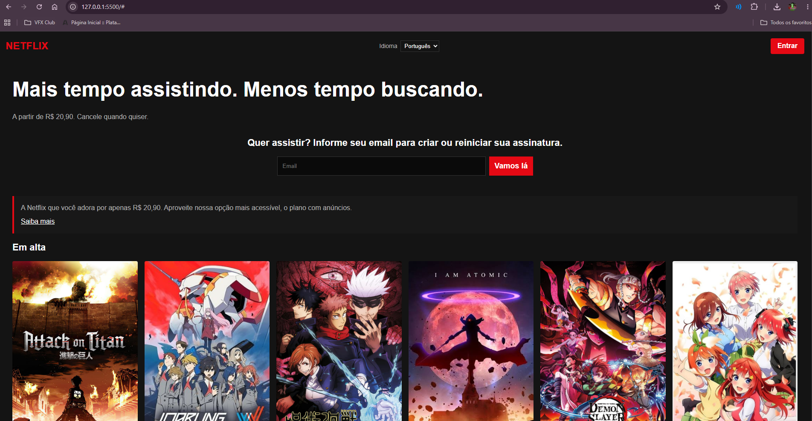
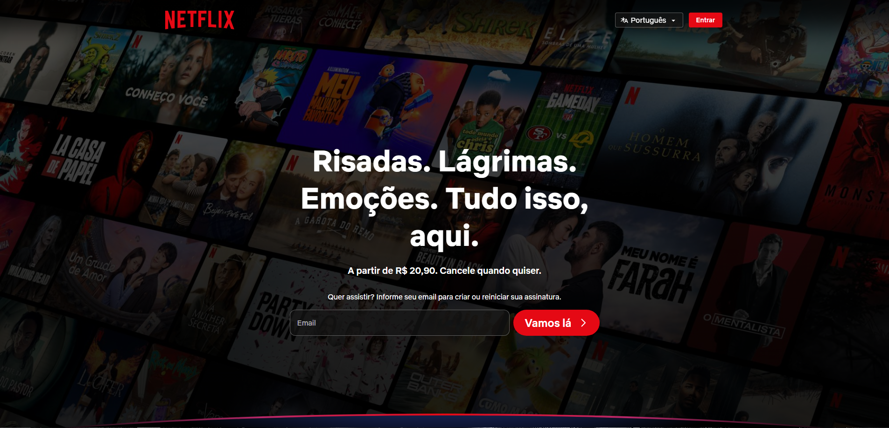
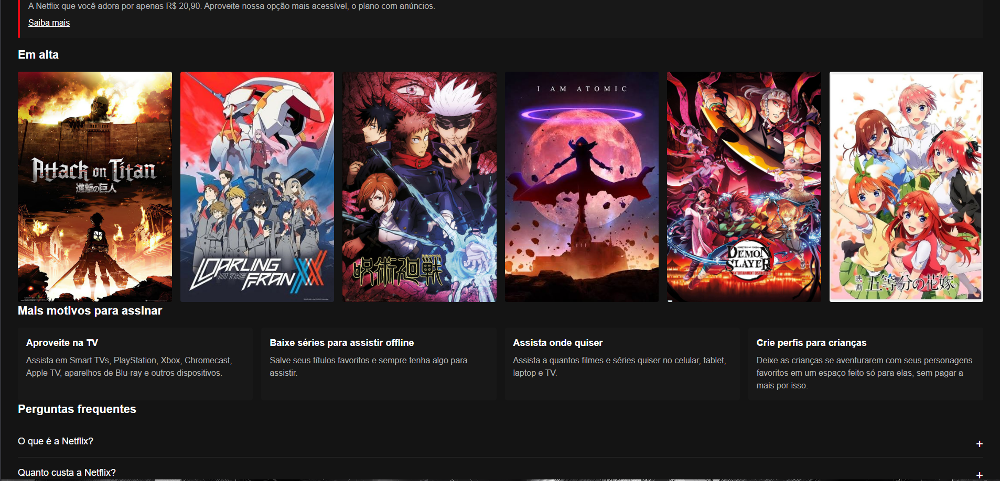
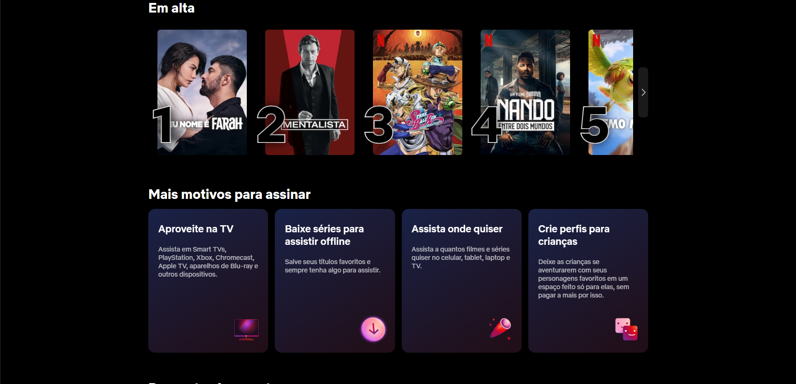
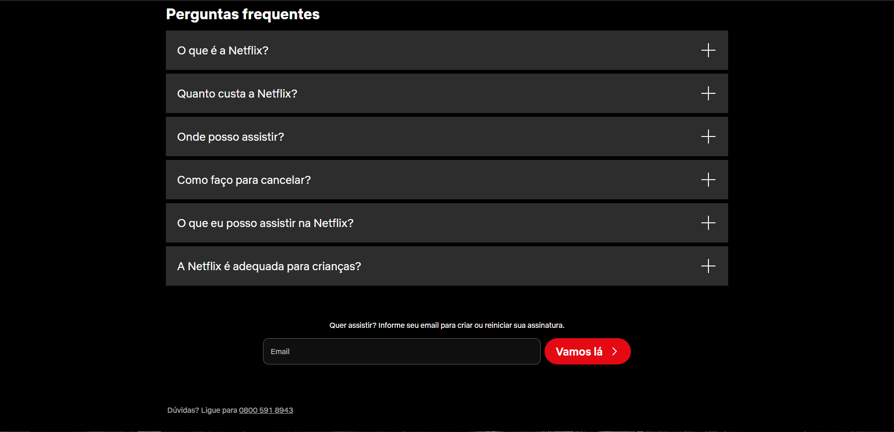

Clone Netflix — Atividade de HTML e CSS
Nome: Thiago Medeiros
Nome: Vitor Gomide
RA: 1134836
RA: 1140037

Site de referência: https://www.netflix.com/br/ (página inicial, deslogado)

Checklist da Parte 1
1.1 Estrutura HTML semântica e acessível
header, main, section, article, aside, footer e duas nav usados conforme o conteúdo de cada bloco.
Todas as imagens têm alt descritivo.
Dois formulários acessíveis (hero e footer), cada campo com label associado via for/id (os labels ficam ocultos visualmente com a técnica position: absolute; left: -9999px, mas continuam disponíveis para leitores de tela).
Skip link (Pular para o conteúdo) no início do body, visível apenas ao receber foco pelo teclado.

Análise da página original: o HTML real da Netflix é renderizado via JavaScript (React), então o <body> inicial só contém 
s genéricas (como div#appMountPoint) sem nenhuma tag semântica visível no código-fonte estático. Por isso, a estrutura semântica deste clone (header, main, section, article, footer) foi definida a partir da análise visual da página, e não copiada do código original, o que também melhora a acessibilidade em relação ao site real.

1.2 Fidelidade visual à referência escolhida
Cores, tipografia e organização geral (header, hero, seções de conteúdo, footer) seguem o site original.
Diferença justificada: a fonte usada é 'Helvetica Neue'/Arial (fonte de sistema), no lugar da fonte proprietária da Netflix, para evitar uso de fonte paga.
Diferença justificada: o conteúdo da seção "Em alta" foi adaptado para exibir capas de animes (Attack on Titan, Darling in the Franxx, Jujutsu Kaisen, The Eminence in Shadow, Demon Slayer e The Quintessential Quintuplets), como personalização temática do projeto, no lugar dos títulos originais da plataforma.

1.3 CSS: seletores, box model e variáveis
Variáveis CSS em :root para cores, fonte e espaçamentos.
Pelo menos três tipos de seletor: seletor de atributo (section[aria-labelledby="..."]), pseudo-classe (:hover, :focus, :first-child, :last-child) e seletor descendente (header form label, footer nav a).
box-sizing: border-box aplicado globalmente no reset.

1.4 Responsividade: Flexbox, Grid e mobile first
CSS escrito mobile first: o layout base (sem media query) já funciona em telas pequenas, empilhando os blocos.
Flexbox usado no header e nos formulários (hero e footer).
CSS Grid usado na seção "Em alta" (imagens) e em "Mais motivos para assinar" (cards).
Uma media query @media (min-width: 768px) ajusta o layout para telas maiores (header e formulários em linha, grids com mais colunas, nav do footer organizada em colunas).
Testado em janela larga (desktop) e estreita (celular).

1.5 Personalização e originalidade
Seção "Sobre este clone" (no fim da página), que não existe no site original, com os nomes dos autores e explicação da atividade.

Prints comparando o resultado com o original

### Topo da página (Header + Hero)
Meu clone:

Netflix original:

### Em alta + Mais motivos para assinar
Meu clone:

Netflix original:

### FAQ + Footer
Meu clone:

Netflix original:

Observações
Este projeto é uma atividade acadêmica sem nenhum vínculo com a Netflix, Inc. Não copia o código-fonte do site original, apenas reproduz o resultado visual observado.
Assista a séries e filmes online diretamente na sua Smart TV, PC ou Mac, videogame, tablet, smartphone e mais.